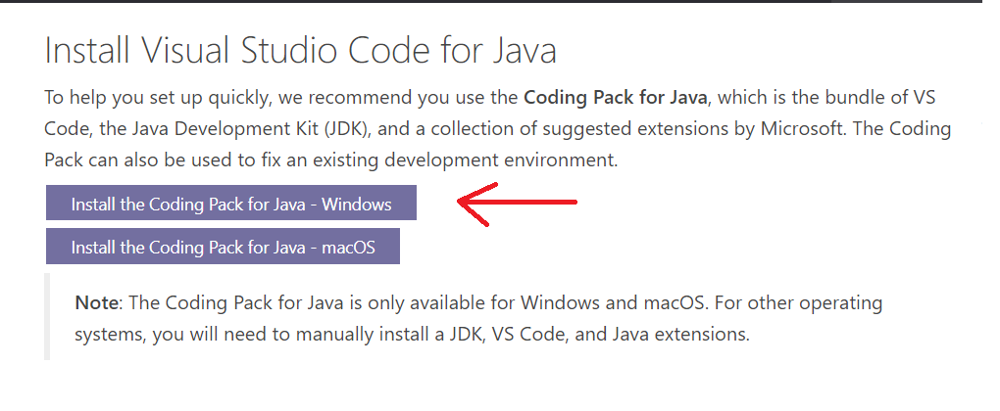
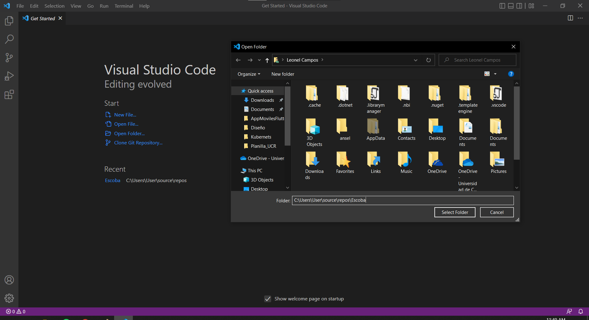
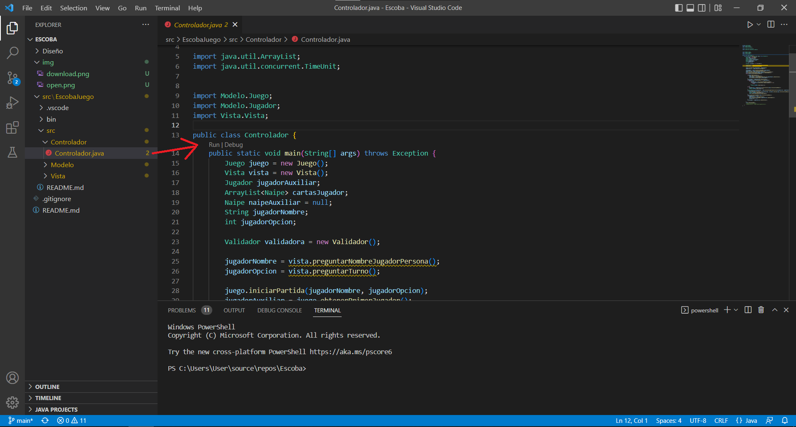

# Implementación del juego Escoba en Java para el curso diseño de software

## Estudiantes 

1. Angie Sofia Castillo Campos
2. Nayeri Azofeifa Porras
3. Jeremy Vargas Artavia
4. Leonel Steven Campos Murillo

## Descripción del sistema

El presente código tiene dos implementaciones: una implementación concreta del código especificamente del juego Escoba (para una descripción de como funciona puede visitar el siguiente link: https://www.nhfournier.es/como-jugar/escoba/) y otra implementación de un MARDA para cualquier tipo de juego de cartas. El diseño de ambos se encuentran en el folder Diseño, la documentación del código se encuentra en la carpeta llamada Documento dentro del folder Marda

## Ejecutar Juego ( carpeta src/EscobaJuego)

1) Aquí puede encontrar una guía para preparar el entorno de ejecución del juego.
https://code.visualstudio.com/docs/languages/java#_install-visual-studio-code-for-java

2. Una vez instalado el paquete para codificación en java, se procede a abrir el directorio de la aplicación utilizando VS Code

3.  VS Code provee la posibilidad de ejecutar el programa como un botón que dice "Run" sobre el main de la aplicación.

## Ejecutar MARDA: 

1. Debe ingresar a la carpeta llamada Marda para ejecutar el proyecto.

2. Puede ejecutar el .jar llamado "Marda.jar" que se encuentra en la carpeta Marda. Abriendo el cmd desde la carpte Marda y ejecutando "java -jar Marda.jar". Si desea ejecutarlo directamente desde el código, puede hacerlo desde el .java llamado ControladorEscoba.
